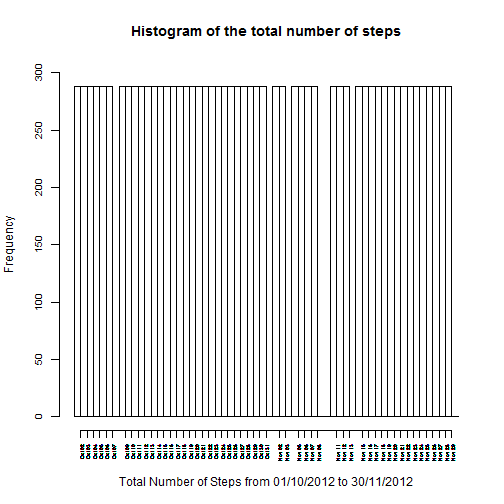
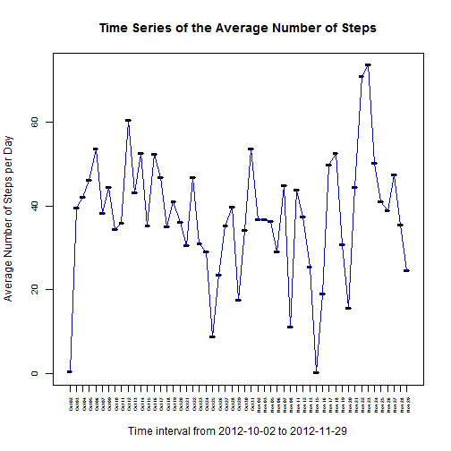
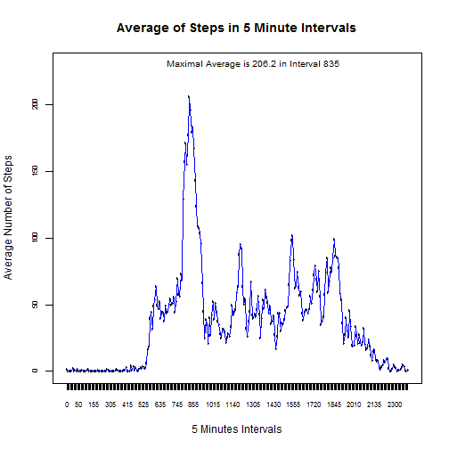
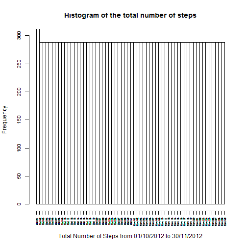
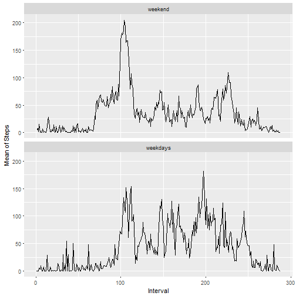

```r
Sys.setlocale("LC_TIME", "US")  
```

```
## [1] "English_United States.1252"
```

```r
## Packages
   library("plyr")
   library("stringr")
   library("lubridate")
   library("ggplot2")
   library("markdown")
   library("rmarkdown")
   library("knitr")

##--------------------------------------------------------------------------------
## function read_data_activity
## task:
##   - download file from URL
##   - read csv-file
##   - create dataframe 'my_activity'
## arguments
## return
##   data frame with colums ("steps", "date", "interval")
read_data_activity <- function( ... ) {
  
  ## source from website
  l_fileURL <- "https://d396qusza40orc.cloudfront.net/repdata%2Fdata%2Factivity.zip"
  
  ## zip-file from website
  l_file_zip <- "repdata_data_activity.zip"
  
  ## csv-file in default path
  l_filename <- "activity.csv"
  
  ## Download zip-file from url-source "repdata_data_activity.zip"
  download.file( url = l_fileURL,
                 destfile = l_file_zip,
                 method = "auto",
                 mode = "wb" )
  
  ## unzip of the csv-file "activity.csv"
  unzip( zipfile = l_file_zip,
         files = l_filename )
  
  if ( file.exists( file = l_filename ) ) {
  
    ## read csv-file
    my_activity <- read.csv( file = l_filename, 
                             header = TRUE, 
                             sep = ",",
                             dec = "." )
    ## return data frame
    my_activity
    
  } else {
    
    ## error-message
    stop( paste( "File ", l_filename, "not found!") )
    
  }  
  
}


##--------------------------------------------------------------------------------
## function read_data_activity
## task:
##   - download file from URL
##   - read csv-file
##   - create dataframe 'my_activity'
## arguments
## return
##   data frame with colums ("steps", "date", "interval")
read_data_activity <- function( ... ) {
  
  ## source from website
  l_fileURL <- "https://d396qusza40orc.cloudfront.net/repdata%2Fdata%2Factivity.zip"
  
  ## zip-file from website
  l_file_zip <- "repdata_data_activity.zip"
  
  ## csv-file in default path
  l_filename <- "activity.csv"
  
  ## Download zip-file from url-source "repdata_data_activity.zip"
  download.file( url = l_fileURL,
                 destfile = l_file_zip,
                 method = "auto",
                 mode = "wb" )
  
  ## unzip of the csv-file "activity.csv"
  unzip( zipfile = l_file_zip,
         files = l_filename )
  
  if ( file.exists( file = l_filename ) ) {
  
    ## read csv-file
    my_activity <- read.csv( file = l_filename, 
                             header = TRUE, 
                             sep = ",",
                             dec = "." )
    ## return data frame
    my_activity
    
  } else {
    
    ## error-message
    stop( paste( "File ", l_filename, "not found!") )
    
  }  
  
}
   

##--------------------------------------------------------------------------------
## function preprocesses_data_activity( df )
## task:
##   - remove, if steps is NA 
##   - create new columns "weekday" and "day"
##   - create dataframe 'my_act'
## arguments
##   - df data frame with columns("steps", "date", "interval")
##return
##   - list of two data frames my_act and my_act_na
##
preprocessed_data_activity <- function( df ) {
  
  ## add new columns "weekday" and "day"
  my_df <- transform_act_date( df = df )
  ## sort by comluns "date" and "interval"
  my_df <- arrange(my_df, date, interval)  
  
  ## data frame without rows with NA     
  my_act <- subset( my_df, is.na(my_df$steps) == FALSE )
  ## data frame only with roWs WITH NA 
  my_act_na <- subset( my_df, is.na(my_df$steps) == TRUE )
  
  ## return of two data frames
  list( my_act, my_act_na )  

}


##--------------------------------------------------------------------------------
## function transform_act_date( df )
## task:
##   create new columns "weekday" and "day"
##   sort data frame by columns "date" and "interval" 
## arguments
##   - df data frame with columns("steps", "date", "interval", "weekday", "day")
##
transform_act_date <- function( df ) {
  
  ## weekday
  my_act <- transform( df, 
                       weekday = format(as.Date(date), "%a") )
  
  ## day: month dd
  my_act <- transform( my_act, 
                       day = format(as.Date(date), "%b %d") )  
  
  my_act <- arrange( my_act, date, interval )
  
  my_act
  
}


##--------------------------------------------------------------------------------
## function plot_hist_per_day( df )
## task:
##   plot histogram of number of steps per each day 
## arguments
##   df data frame with columns( "steps", "date", "interval", "weekday", "day" )
## return
##   histogram
##
plot_hist_per_day <- function( df, f_screen = FALSE ) {

  ## label for x-axis
  l_xlab <- paste( "Total Number of Steps from", 
                    "01/10/2012 to 30/11/2012" )

  ## breaks 
  l_xlim <- rep(1:length(levels(df$date)), 1)

  if ( f_screen == FALSE ) {
    ## graphic device pnp
    png(filename = "hist_steps_per_day.png", width = 480, height = 480)
  } 
  
  ## histogram
  hist( unclass(df$date),
        main = "Histogram of the total number of steps",
        breaks = l_xlim,
        las = 3,
        xaxt = "n",
        cex.axis = 0.8,
        xlim = range(l_xlim),
        xlab = l_xlab,
        ylim = c(0, 300) )
  
  axis( side = 1,
        las = 3,
        at = df$date, 
        labels = df$day,
        cex.axis = 0.4 ) 
  
  if ( f_screen == FALSE ) {
    ## device back to screen
    dev.off()
  }
  
}

##--------------------------------------------------------------------------------
## function get_mean_median_per_day( df )
## task:
##   - Mean and median number of steps taken each day
## arguments
##   - df data frame with columns( "steps", "date", "interval" )
## return
##   data frame 
##
get_mean_median_per_day <- function( df ) {

  ## select field "df$date" for aggregate
  l_by_day <- list(factor(df$date))
  
  ## aggregate mean per day
  l_mean <- aggregate(x = df$steps, by = l_by_day, FUN = "mean")
  
  ## aggregate median per day
  l_median <- aggregate(x = df$steps, by = l_by_day, FUN = "median")
  
  ## which is the meadian per day
  median_which <- NA
  for ( idx in 1:53) { 
    median_which[idx] <- which( df$steps[idx] == l_median$x[idx] )
    idx <- idx + 1 
  }
  
  ## new named; filed "mean_of_steps"
  l_mean <- rename( l_mean,
                    replace = c( "Group.1" = "date", 
                                 "x" = "mean_of_steps" ) )
  
  ## binding to processed data
  my_mean_median <- cbind( l_mean,
                           l_median$x,
                           median_which )
  
  ## new named: field "median_of_steps"
  my_mean_median <- rename( my_mean_median, 
                            replace = c( "l_median$x" = "median_of_steps" ) )
  
  ## sort by column "date"
  my_mean_median <- arrange( my_mean_median, date )
  
  my_mean_median
}

##--------------------------------------------------------------------------------
## function plot_time_series_of_steps( df )
## task:
##   Time series plot of the average number of steps taken 
## arguments
##   df data frame with columns( "steps", "date", "interval" )
## return
##   plot time series
##
plot_time_series_of_steps <- function( df, f_screen = FALSE ) {

  if ( f_screen == FALSE ) {
    ## graphic device pnp
    png( filename = "time_series_of_steps_per_day.png", 
         width = 480, 
         height = 480 )
  }    
  
  ## label for x-axis
  l_xlab <- paste( "Time interval from", 
                   df$date[1],
                   "to",
                   df$date[length(df$date)] )  
  
  ## day: month dd
  df <- transform( df, 
                   day = format(as.Date(date), "%b %d") )    
  
  ## scatterplot
  with( df, plot( x = df$date, 
                  y = df$mean_of_steps,
                  main = "Time Series of the Average Number of Steps",
                  type = "b", 
                  las = 3,
                  xaxt = "n",
                  cex.axis = 0.8,
                  xlab = l_xlab,
                  ylab = "Average Number of Steps per Day") )
  
  ## notation of x-axis
  axis( side = 1,
        las = 3,
        at = df$date, 
        labels = df$day,
        cex.axis = 0.45 )   

  ## plot lines
  lines( x = df$date, 
         y = df$mean_of_steps, 
         col = "blue",
         type = "l",
         lty = 1, 
         lwd = 1)
  
  if ( f_screen == FALSE ) {
    ## device back to screen
    dev.off()
  }  
    
} 


##--------------------------------------------------------------------------------
## function plot_time_series_of_steps_per_5min( df, f_screen )
## task:
##   Time series plot of the average number of steps taken 
## arguments
##   df data frame with columns( "steps", "date", "interval" )
## return
##   plot
##
plot_time_series_of_steps_per_5min <- function( df, f_screen = TRUE ) {
  
  ## select field "df$interval" for aggregate
  l_by_interval <- list(factor(as.factor(df$interval)))
  
  ## aggregate mean per interval
  my_mean <- aggregate(x = df$steps, by = l_by_interval, FUN = "mean")
  
  ## rename
  my_mean <- rename( my_mean, 
                     replace = c( "Group.1" = "interval",
                                  "x" = "mean_of_steps" ) )
  ## sort by column "interval"
  my_mean <- arrange( my_mean, interval )
  
  if ( f_screen == FALSE ) {
    ## graphic device pnp
    png( filename = "time_series_of_steps_per_5min.png", 
         width = 480, 
         height = 480 )
  }    
  
  ## scatterplot
  with( df, plot( x = my_mean$interval, 
                  y = my_mean$mean_of_steps,
                  main = "Average of Steps in 5 Minute Intervals",
                  type = "b", 
                  cex.axis = 0.7,
                  ylim = c(0, 230),
                  xlab = "5 Minutes Intervals",
                  ylab = "Average Number of Steps") ) 
  
  lines( x = my_mean$interval, 
         y = my_mean$mean_of_steps, 
         col = "blue",
         type = "l",
         lty = 1, 
         lwd = 1)    
  
  ## on average the maximum number of steps
  l_max <- my_mean$interval[ which( my_mean$mean_of_steps == max(my_mean$mean_of_steps) ) ] 
  
  ## The 5-minute interval that, on average, contains the maximum number of steps
  l_max_interval <- paste( "Maximal Average is", round(max(my_mean$mean_of_steps), digits=1),
                           "in Interval", l_max )
  ## legend
  legend( "top", 
          legend = l_max_interval,
          fill = "white",
          border = "white",
          bty = "n",            
          col = "white", 
          cex = 0.8,
          ncol = 1, 
          lwd = 1)    
  
  if ( f_screen == FALSE ) {
    ## device back to screen
    dev.off()
  }    
  
}


##--------------------------------------------------------------------------------
## function impute_missing_value( df, df_na )
## task:
##   - Code to describe and show a strategy for imputing missing data
##     by bootstrap
## arguments
##   - df data frame with columns( "steps", "date", "interval" )
## return
##   - data frame with columns( "steps", "date", "interval", "weekday", "day" )  
##
impute_missing_value <- function( df, df_na ) {

  
  idx <- 1
  
  for ( idx in 1:7 ) {
    
    switch(as.character(idx),
                           ##timezone     ## US                 ## german
      "1" = my_sub <- subset( df, df$weekday == "Mon" | df$weekday == "Mo" ),
      "2" = my_sub <- subset( df, df$weekday == "Tue" | df$weekday == "Di" ),
      "3" = my_sub <- subset( df, df$weekday == "Wed" | df$weekday == "Mi" ),
      "4" = my_sub <- subset( df, df$weekday == "Thu" | df$weekday == "Do" ),
      "5" = my_sub <- subset( df, df$weekday == "Fri" | df$weekday == "Fr" ),
      "6" = my_sub <- subset( df, df$weekday == "Sat" | df$weekday == "Sa" ),
      "7" = my_sub <- subset( df, df$weekday == "Sun" | df$weekday == "So" ) )
    
    switch(as.character(idx),
                              ##timezone     ## US                 ## german
      "1" = my_sub_na <- subset( df_na, df_na$weekday == "Mon" | df_na$weekday == "Mo" ),
      "2" = my_sub_na <- subset( df_na, df_na$weekday == "Tue" | df_na$weekday == "Di" ),
           "3" = my_sub_na <- subset( df_na, df_na$weekday == "Wed" | df_na$weekday == "Mi" ),
           "4" = my_sub_na <- subset( df_na, df_na$weekday == "Thu" | df_na$weekday == "Do" ),
           "5" = my_sub_na <- subset( df_na, df_na$weekday == "Fri" | df_na$weekday == "Fr" ),
           "6" = my_sub_na <- subset( df_na, df_na$weekday == "Sat" | df_na$weekday == "Sa" ),
           "7" = my_sub_na <- subset( df_na, df_na$weekday == "Sun" | df_na$weekday == "So" ) )
    
    if ( length(my_sub_na$date) > 0 ) {
    
      my_data <- impute_missing( df = my_sub, df_na = my_sub_na )
      ## missing data replaced
      if ( idx == 1 ) {
        my_act_impute <- my_data
      } else {
        my_act_impute <- rbind( my_act_impute, my_data )
      }
    } else {
      ## no missing data
      if ( idx == 1 ) {
        my_act_impute <- my_sub
      } else {
        my_act_impute <- rbind( my_act_impute, my_sub )
      }
    }
    
    idx <- idx + 1
  }
  
  ## sort
  my_act_impute <- arrange(my_act_impute, date, steps)
  
  ## weekend / weekday
  my_act_impute <- mutate( my_act_impute, 
                           weekendcat = factor( my_act_impute$weekday == "Sat" |
                                                my_act_impute$weekday == "Sun",
                                                labels = c("weekend", "weekdays") )
                         )  
  
  my_act_impute

}


##--------------------------------------------------------------------------------
## function impute_missing( df, df_na )
## task:
##   - Code to describe and show a strategy for imputing missing data 
## arguments
##   - df    data frame without NA value
##   - df_na data frame only with NA values
## return
##   - data frame mit sampled "new" data for "steps"
##
impute_missing <- function( df, df_na ) {
  
  if ( length(df_na$date) > 0 ) {
  
    ## define start point
    set.seed(42)

    ## bootstrap sampling per weekday
    l_sample <- sample(x = df$steps, size = length(df_na$steps), replace = FALSE )
  
    my_df_na <- df_na
  
    for ( idx in 1:length(my_df_na$steps) ) {
      my_df_na$steps[idx] <- l_sample[idx] 
      idx <- idx + 1
    }
  
    my_data <- rbind( df, my_df_na )
    
  } else {
    my_data <- df
  }
  
  my_data
  
}


##--------------------------------------------------------------------------------
## function plot_compare_ave_number_of_steps( df, f_screen = FALSE  )
## task:
##   Panel plot comparing the average number of steps taken 
##   per 5-minute interval across weekdays and weekends
## arguments
##   df data frame with columns( "steps", "date", "interval" )
## return
##   plot
##
plot_compare_ave_number_of_steps <- function( df, f_screen = FALSE ) {
  
  ## select field "df$interval" for aggregate
  l_by_interval <- list( factor(as.factor(df$interval)), df$weekendcat )
  
  ## aggregate mean per interval
  my_mean <- aggregate(x = df$steps, by = l_by_interval, FUN = "mean")
  
  ## rename
  my_mean <- rename( my_mean, 
                     replace = c( "Group.1" = "interval",
                                  "Group.2" = "weekendcat",
                                  "x" = "mean_of_steps" ) )
  ## sort by column "interval"
  my_mean <- arrange( my_mean, interval, weekendcat )
  
  if ( f_screen == FALSE ) {
    ## graphic device pnp
    png( filename = "time_series_of_steps_per_day.png", 
         width = 480, 
         height = 480 )
  }      
  
  ## plots
  g <- ggplot( my_mean, aes( as.numeric(interval), mean_of_steps )) 
  p <- g + geom_line() + facet_wrap( ~weekendcat, nrow=2, ncol=1 ) + labs(x="Interval",  y="Mean of Steps") 
  print(p)
  
  if ( f_screen == FALSE ) {
    ## device back to screen
    dev.off()
  }    
  
}

##--------------------------------------------------------------------------------
## function plot_compare_ave_number_of_steps( df, f_screen = FALSE  )
## task:
##   Panel plot comparing the average number of steps taken 
##   per 5-minute interval across weekdays and weekends
## arguments
##   df data frame with columns( "steps", "date", "interval" )
## return
##   plot
##
plot_compare_ave_number_of_steps <- function( df, f_screen = FALSE ) {
  
  ## select field "df$interval" for aggregate
  l_by_interval <- list( factor(as.factor(df$interval)), df$weekendcat )
  
  ## aggregate mean per interval
  my_mean <- aggregate(x = df$steps, by = l_by_interval, FUN = "mean")
  
  ## rename
  my_mean <- rename( my_mean, 
                     replace = c( "Group.1" = "interval",
                                  "Group.2" = "weekendcat",
                                  "x" = "mean_of_steps" ) )
  ## sort by column "interval"
  my_mean <- arrange( my_mean, interval, weekendcat )
  
  if ( f_screen == FALSE ) {
    ## graphic device pnp
    png( filename = "time_series_of_steps_per_day.png", 
         width = 480, 
         height = 480 )
  }      
  
  ## plots
  g <- ggplot( my_mean, aes( as.numeric(interval), mean_of_steps )) 
  p <- g + geom_line() + facet_wrap( ~weekendcat, nrow=2, ncol=1 ) + labs(x="Interval",  y="Mean of Steps") 
  print(p)
  
  if ( f_screen == FALSE ) {
    ## device back to screen
    dev.off()
  }    
  
}
```


## Loading and preprocessing the data

# Raw data

Data from website

https://d396qusza40orc.cloudfront.net/repdata%2Fdata%2Factivity.zip

This device collects data at 5 minute intervals through out the day. The data consists of two months of data from an anonymous individual collected during the months of October and November, 2012 and include the number of steps taken in 5 minute intervals each day.

Dataset: Activity monitoring data [52K]

The variables included in this dataset are:

* steps: Number of steps taking in a 5-minute interval 
         (missing values are coded as NA)

* date: The date on which the measurement was taken in YYYY-MM-DD format

* interval: Identifier for the 5-minute interval in which measurement was taken

The dataset is stored in a comma-separated-value (CSV) file and there are 
a total of 17,568 observations in this dataset.


# Load the data (i.e. read.csv())

The download of the zip-file with the "Activity monitoring data" from the website
will doing everytime automatically by the command "download.file()".  

There are three steps to get the dataset:
* download the zip-file from the website
* unzip and save the csv-file "activity.csv"
* read the csv-file and provide the data frame "my_activity"


```r
   ## 1.1 Load the data (i.e. read.csv())
   my_activity <- read_data_activity()
```

# Process/transform the data (if necessary) into a format suitable for your analysis

After reading the dataset there is a function to preprocess and transform the
rawdata.

The following steps are doing:
* new column "weekday" and "day" are added
* sort of the data frame by columns "date" and "interval" 
* split of the data frame in two new data frames 
  'my_act'     without NA values in column "steps"
  'my_act_na'  only with NA values in column "steps" for later preperation


```r
   ## 1.2 Process/transform the data into a format suitable for your analysis
   my_act_list <- preprocessed_data_activity( df = my_activity )
   ## rows without NA values 
   my_act <- my_act_list[[1]]
   ## rows only with NA values
   my_act_na <- my_act_list[[2]]
   
   ## rows without NA values in column "steps"
   str(my_act)
```

```
## 'data.frame':	15264 obs. of  5 variables:
##  $ steps   : int  0 0 0 0 0 0 0 0 0 0 ...
##  $ date    : Factor w/ 61 levels "2012-10-01","2012-10-02",..: 2 2 2 2 2 2 2 2 2 2 ...
##  $ interval: int  0 5 10 15 20 25 30 35 40 45 ...
##  $ weekday : Factor w/ 7 levels "Fri","Mon","Sat",..: 6 6 6 6 6 6 6 6 6 6 ...
##  $ day     : Factor w/ 61 levels "Nov 01","Nov 02",..: 32 32 32 32 32 32 32 32 32 32 ...
```

```r
   lv_obs <- length(my_act$date)
```

There are 15264 observations with values ( not NA's ) for the column 'steps'.


## What is mean total number of steps taken per day?

For this part of the assignment, you can ignore the missing values in the dataset.
1. Make a histogram of the total number of steps taken each day


```r
## Histogram of the total number of steps taken each day
   plot_hist_per_day( df = my_act, f_screen = TRUE )
```



There are any days (par example 10/11/2012) without observations. 


2. Calculate and report the mean and median total number of steps taken per day


```r
## Mean and median number of steps taken each day
   my_mean_median <- get_mean_median_per_day( df = my_act )
## HTML output 
   print(my_mean_median, type="html")
```

```
##          date mean_of_steps median_of_steps median_which
## 1  2012-10-02     0.4375000               0            1
## 2  2012-10-03    39.4166667               0            1
## 3  2012-10-04    42.0694444               0            1
## 4  2012-10-05    46.1597222               0            1
## 5  2012-10-06    53.5416667               0            1
## 6  2012-10-07    38.2465278               0            1
## 7  2012-10-09    44.4826389               0            1
## 8  2012-10-10    34.3750000               0            1
## 9  2012-10-11    35.7777778               0            1
## 10 2012-10-12    60.3541667               0            1
## 11 2012-10-13    43.1458333               0            1
## 12 2012-10-14    52.4236111               0            1
## 13 2012-10-15    35.2048611               0            1
## 14 2012-10-16    52.3750000               0            1
## 15 2012-10-17    46.7083333               0            1
## 16 2012-10-18    34.9166667               0            1
## 17 2012-10-19    41.0729167               0            1
## 18 2012-10-20    36.0937500               0            1
## 19 2012-10-21    30.6284722               0            1
## 20 2012-10-22    46.7361111               0            1
## 21 2012-10-23    30.9652778               0            1
## 22 2012-10-24    29.0104167               0            1
## 23 2012-10-25     8.6527778               0            1
## 24 2012-10-26    23.5347222               0            1
## 25 2012-10-27    35.1354167               0            1
## 26 2012-10-28    39.7847222               0            1
## 27 2012-10-29    17.4236111               0            1
## 28 2012-10-30    34.0937500               0            1
## 29 2012-10-31    53.5208333               0            1
## 30 2012-11-02    36.8055556               0            1
## 31 2012-11-03    36.7048611               0            1
## 32 2012-11-05    36.2465278               0            1
## 33 2012-11-06    28.9375000               0            1
## 34 2012-11-07    44.7326389               0            1
## 35 2012-11-08    11.1770833               0            1
## 36 2012-11-11    43.7777778               0            1
## 37 2012-11-12    37.3784722               0            1
## 38 2012-11-13    25.4722222               0            1
## 39 2012-11-15     0.1423611               0            1
## 40 2012-11-16    18.8923611               0            1
## 41 2012-11-17    49.7881944               0            1
## 42 2012-11-18    52.4652778               0            1
## 43 2012-11-19    30.6979167               0            1
## 44 2012-11-20    15.5277778               0            1
## 45 2012-11-21    44.3993056               0            1
## 46 2012-11-22    70.9270833               0            1
## 47 2012-11-23    73.5902778               0            1
## 48 2012-11-24    50.2708333               0            1
## 49 2012-11-25    41.0902778               0            1
## 50 2012-11-26    38.7569444               0            1
## 51 2012-11-27    47.3819444               0            1
## 52 2012-11-28    35.3576389               0            1
## 53 2012-11-29    24.4687500               0            1
```


## What is the average daily activity pattern?

1. Make a time series plot (i.e. type = "l") of the 5-minute interval (x-axis) and the average number of steps taken, averaged across all days (y-axis)


```r
## Time series plot of the average number of steps taken
   plot_time_series_of_steps( df = my_mean_median, f_screen = TRUE )
```




2. Which 5-minute interval, on average across all the days in the dataset, contains the maximum number of steps?


```r
## The 5-minute interval that, on average, contains the maximum number of steps
   plot_time_series_of_steps_per_5min( df = my_act, f_screen = TRUE )
```




The maximale average is 206,2 that was calculates for the interval after 835 minutes. 


## Imputing missing values

Note that there are a number of days/intervals where there are missing values (coded as NA). The presence of missing days may introduce bias into some calculations or summaries of the data.

1. Calculate and report the total number of missing values in the dataset (i.e. the total number of rows with NAs)


```r
  ## in function preprocessed_data_activity( df ) there provide a
  ## data frame 'my_act_na' with only rows NA for 'steps'
  str(my_act_na)
```

```
## 'data.frame':	2304 obs. of  5 variables:
##  $ steps   : int  NA NA NA NA NA NA NA NA NA NA ...
##  $ date    : Factor w/ 61 levels "2012-10-01","2012-10-02",..: 1 1 1 1 1 1 1 1 1 1 ...
##  $ interval: int  0 5 10 15 20 25 30 35 40 45 ...
##  $ weekday : Factor w/ 7 levels "Fri","Mon","Sat",..: 2 2 2 2 2 2 2 2 2 2 ...
##  $ day     : Factor w/ 61 levels "Nov 01","Nov 02",..: 31 31 31 31 31 31 31 31 31 31 ...
```

```r
  lv_obs_na <- length(my_act_na$date)
```

There are 2304 observation with no value ( NA's ) for the column 'steps'.


2. Devise a strategy for filling in all of the missing values in the dataset. The strategy does not need to be sophisticated. For example, you could use the mean/median for that day, or the mean for that 5-minute interval, etc.


```r
##--------------------------------------------------------------------------------
## function impute_missing( df, df_na )
## task:
##   - Code to describe and show a strategy for imputing missing data 
## arguments
##   - df    data frame without NA value
##   - df_na data frame only with NA values
## return
##   - data frame mit sampled "new" data for "steps"
##
impute_missing <- function( df, df_na ) {
  
  if ( length(df_na$date) > 0 ) {
  
    ## define start point
    set.seed(42)

    ## bootstrap sampling per weekday
    l_sample <- sample(x = df$steps, size = length(df_na$steps), replace = FALSE )
  
    my_df_na <- df_na
  
    for ( idx in 1:length(my_df_na$steps) ) {
      my_df_na$steps[idx] <- l_sample[idx] 
      idx <- idx + 1
    }
  
    my_data <- rbind( df, my_df_na )
    
  } else {
    my_data <- df
  }
  
  my_data
  
}
```

The idea to fill in the missing value is to use the right data 'df' and take a bootstrap sampling from a sample on the same weekday with data.

There are the observation on the weekdays with ready value in the field 'steps'. 

```r
print(table(my_act$weekday), type="html") 
```

```
## 
##  Fri  Mon  Sat  Sun  Thu  Tue  Wed 
## 2016 2016 2016 2016 2304 2592 2304
```


Now the observations on the weekdays with missing values in the field 'steps'.

```r
print(table(my_act_na$weekday), type="html")
```

```
## 
## Fri Mon Sat Sun Thu Tue Wed 
## 576 576 288 288 288   0 288
```

On Thesday there is no missing value, so it is ok. And at the others weekdays thers are enough values to take a sample.

After using the R-statement "set.seed(42)" should the reproduciblity of the pseudo numbers be saved. 


3. Create a new dataset that is equal to the original dataset but with the missing data filled in.


```r
## Code to describe and show a strategy for imputing missing data
   my_act_impute <- impute_missing_value( df = my_act, df_na = my_act_na )
## attrbutes of the new data frame with missing data filled in
   str(my_act_impute)
```

```
## 'data.frame':	17568 obs. of  6 variables:
##  $ steps     : int  0 0 0 0 0 0 0 0 0 0 ...
##  $ date      : Factor w/ 61 levels "2012-10-01","2012-10-02",..: 1 1 1 1 1 1 1 1 1 1 ...
##  $ interval  : int  0 5 10 25 30 35 40 50 55 110 ...
##  $ weekday   : Factor w/ 7 levels "Fri","Mon","Sat",..: 2 2 2 2 2 2 2 2 2 2 ...
##  $ day       : Factor w/ 61 levels "Nov 01","Nov 02",..: 31 31 31 31 31 31 31 31 31 31 ...
##  $ weekendcat: Factor w/ 2 levels "weekend","weekdays": 1 1 1 1 1 1 1 1 1 1 ...
```

```r
   lv_obs_new <- length(my_act_impute$date)
```
There are 17568 observation after filled in missing value in field 'steps'.  


4. Make a histogram of the total number of steps taken each day and Calculate and report the mean and median total number of steps taken per day. Do these values differ from the estimates from the first part of the assignment? What is the impact of imputing missing data on the estimates of the total daily number of steps?


```r
## Histogram of the total number of steps taken each day after 
## missing values are imputed
   plot_hist_per_day( df = my_act_impute, f_screen = TRUE )
```



The difference to the first plotting histogram with the misssing value is that in this time all days in the time intervall contain 288 values.


## Are there differences in activity patterns between weekdays and weekends?

For this part the weekdays() function may be of some help here. Use the dataset with the filled-in missing values for this part.

1. Create a new factor variable in the dataset with two levels -- "weekday" and "weekend" indicating whether a given date is a weekday or weekend day.


```r
  ## in function 
  ## weekday
  ## my_act <- transform( df, 
  ##                      weekday = format(as.Date(date), "%a") )
  
  ## in function impute_missing_value() 
  ## weekend / weekday
  ## my_act_impute <- mutate( my_act_impute, 
  ##                         weekendcat = factor( my_act_impute$weekday == "Sat" |
  ##                                              my_act_impute$weekday == "Sun",
  ##                                              labels = c("weekend", "weekdays") )  
```


2. Make a panel plot containing a time series plot (i.e. type = "l") of the 5-minute interval (x-axis) and the average number of steps taken, averaged across all weekday days or weekend days (y-axis). The plot should look something like the following, which was created using simulated data:


```r
## Panel plot comparing the average number of steps taken 
## per 5-minute interval across weekdays and weekends
   plot_compare_ave_number_of_steps( df = my_act_impute, f_screen = TRUE )
```



There are differences of the means of steps between weekend (weekdays Saturday and Sunday) and the other weekdays. Par example the maximale values are on differnt intervals. 

